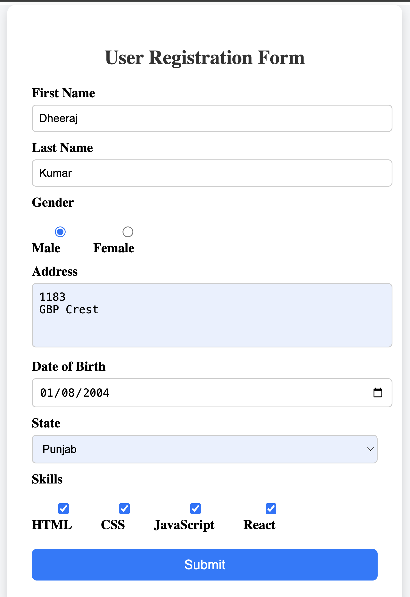
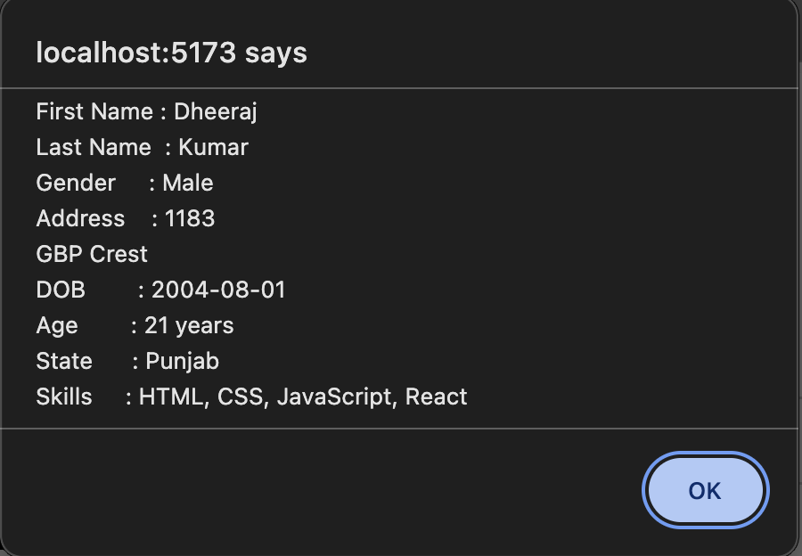
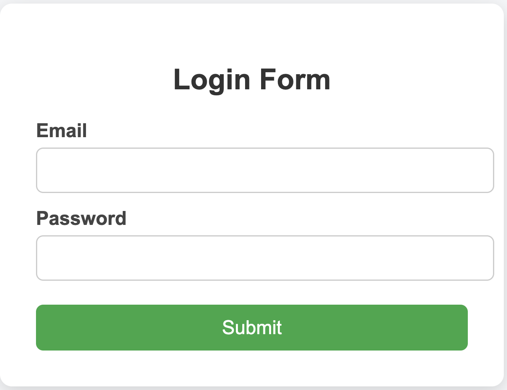
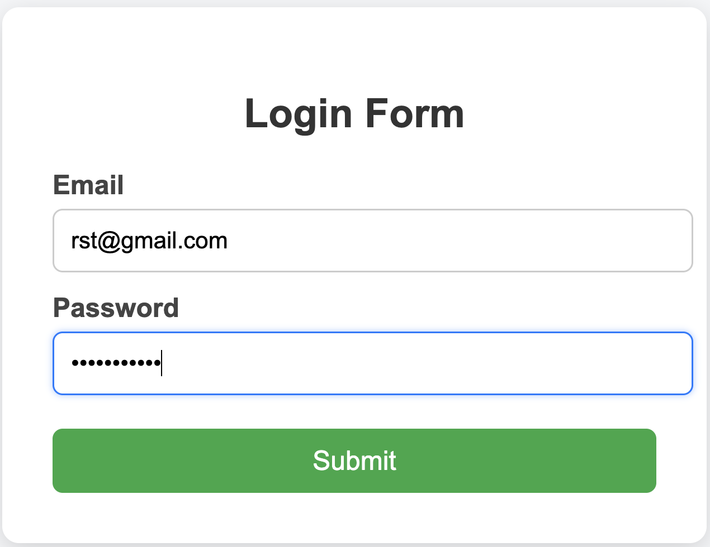
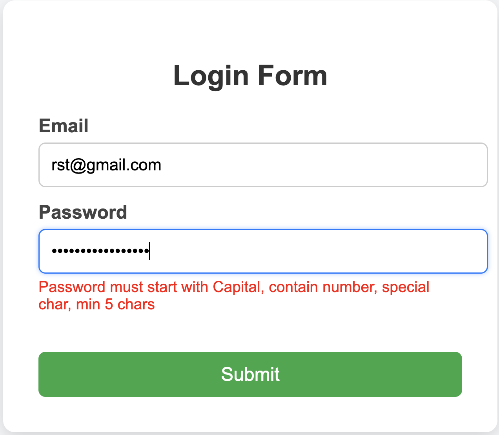
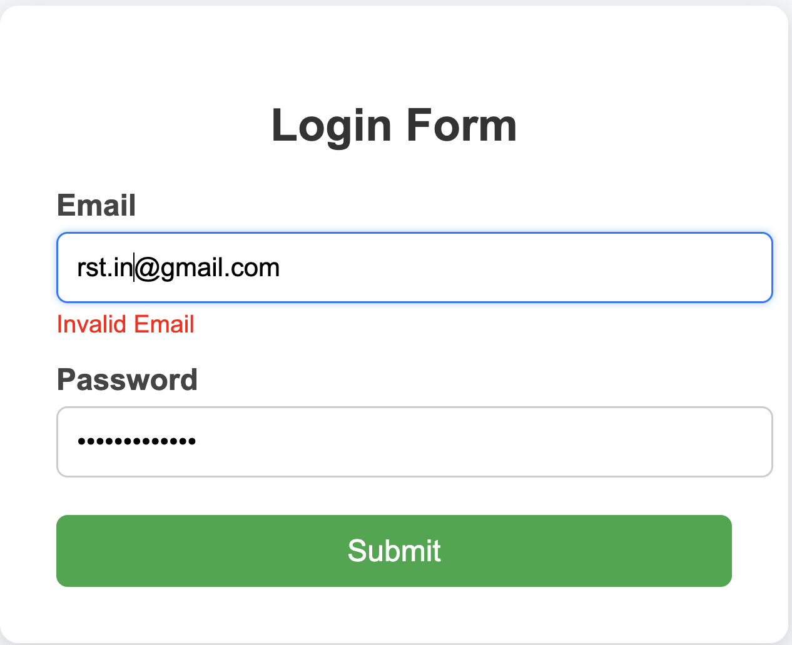
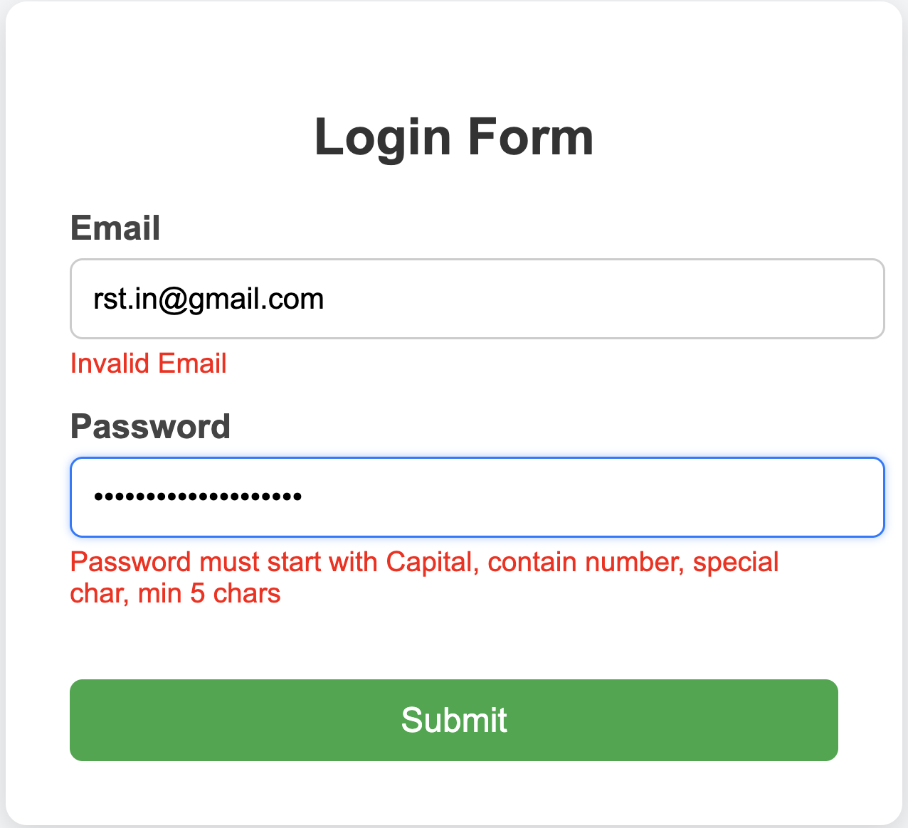

# Unit — Forms Handling and Validation in React

This project demonstrates how to create and manage forms in React using **controlled components** and how to implement **client-side validation** to ensure correct user input before submission.

It includes two experiments:

1. Handling Forms Using Controlled Components  
2. Client-Side Form Validation  

These experiments help understand how React manages form state and improves user experience with real-time validation.

---

# Experiment 1: Handling Forms Using Controlled Components

## Aim
To create and handle forms in a frontend application using controlled components in React.

## Description
Controlled components are React components where form input values are controlled by the component’s state using hooks like `useState`. This approach provides full control over user input and allows developers to implement custom logic such as validation, formatting, and conditional rendering.

In this experiment, form fields are connected to state variables, and input changes are handled through event listeners. When the form is submitted, the data is processed using a submit handler function.

## Software Requirements
- Node.js  
- React  
- VS Code  
- Web Browser  

## Steps Performed
1. Created a React application.
2. Developed a form component.
3. Used `useState` to store input values.
4. Handled input change events.
5. Submitted the form using an event handler.

## Screenshot

---

# Experiment 2: Client-Side Form Validation

## Aim
To validate form inputs on the client side before submission.

## Description
Client-side validation ensures that user inputs meet specific requirements before sending data to the server. It provides immediate feedback to users, improves data accuracy, and reduces unnecessary server requests.

In this experiment, validation rules are applied to form fields such as checking required inputs, validating email format, and ensuring password constraints. Error messages are displayed dynamically, and form submission is allowed only when all validations pass.

## Steps Performed
1. Created form input fields.
2. Defined validation conditions.
3. Displayed error messages.
4. Allowed submission only for valid data.

## Screenshot

---

# Conclusion
Handling forms using controlled components and implementing client-side validation are essential skills in modern frontend development. These techniques provide:

- Better control over form data
- Improved user experience
- Immediate validation feedback
- Reduced server load

Both experiments demonstrate practical approaches to managing and validating forms in React applications.